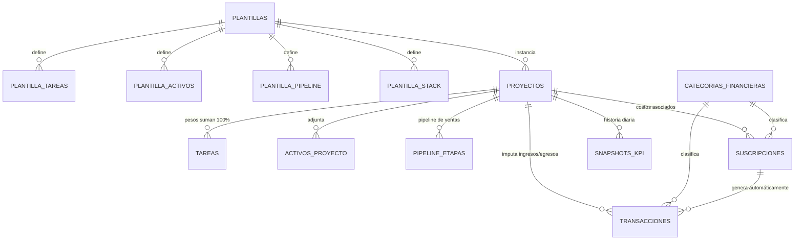

# 01 · Arquitectura del Sistema

## Visión general

```
┌─────────────────────────────────────────────────────────────┐
│  PWA (React + Vite, generada con Lovable)                    │
│  · TanStack Query (caché + offline)  · Recharts (KPIs)       │
│  · Service Worker (instalable, funciona sin conexión)        │
└──────────────┬──────────────────────────────────────────────┘
               │ supabase-js (REST + Realtime + Storage + RPC)
┌──────────────▼──────────────────────────────────────────────┐
│  SUPABASE (Backend as a Service)                             │
│  · Postgres: tablas + vistas KPI (el cálculo vive aquí)      │
│  · RLS: aislamiento por usuario                              │
│  · pg_cron: suscripciones → gastos, snapshots diarios        │
│  · Storage: bucket privado `activos`                         │
│  · Realtime: la UI se actualiza sola al cambiar los datos    │
└─────────────────────────────────────────────────────────────┘
```

## Diagrama Entidad-Relación



## Decisiones de diseño clave

### 1. Libro mayor unificado (`transacciones`)
Toda entrada o salida de dinero es una fila en una sola tabla, clasificada por
dos ejes ortogonales:

- **`flujo`** (`ingreso` / `egreso`): dirección del dinero.
- **`categorias_financieras.capa`** (`inversion` / `ingreso` / `gasto_operativo`): capa de negocio.

Esto responde directamente al requerimiento multicapa sin fragmentar los datos
en tres tablas que luego habría que unir para calcular el ROI. Los ingresos
llevan además `clase_ingreso` (`recurrente`, `pago_unico`, `cuenta_por_cobrar`)
y un `estado` que modela el ciclo de cobro (`pendiente → cobrada` o `vencida`).

**Escalabilidad:** agregar la categoría "Freelancers" o "Equipamiento" mañana es
`INSERT INTO categorias_financieras (...)` — cero migraciones, cero deploys.

### 2. Pesos porcentuales con validación en base de datos
El trigger `trg_validar_pesos` garantiza que la suma de pesos de un proyecto
**nunca exceda 100**. No se exige exactamente 100 en cada escritura (eso
impediría construir el plan tarea por tarea); en su lugar, la vista
`v_progreso_proyecto` expone `pesos_balanceados` para que la UI muestre un
distintivo de "plan incompleto" hasta que la suma llegue a 100.

El avance del proyecto es `SUM(peso WHERE completada)` — completar la tarea de
25% mueve la barra 25 puntos, exactamente como debe ser.

### 3. Alimentación automática (el requisito de modularidad)
Los datos financieros se alimentan de la actividad sin doble captura:

| Evento | Mecanismo | Resultado |
|---|---|---|
| Vence la renovación de una suscripción | `pg_cron` diario → `generar_gastos_suscripciones()` | Se inserta la transacción de egreso y avanza `proxima_renovacion` |
| Pasa la fecha esperada de una cuenta por cobrar | `pg_cron` diario → `marcar_cuentas_vencidas()` | El estado pasa a `vencida` y la UI la resalta |
| Cualquier transacción o tarea cambia | Vistas SQL (siempre frescas) + Supabase Realtime | El ROI del dashboard se actualiza sin recargar |
| Cada día a las 06:30 UTC | `tomar_snapshots_kpi()` | Foto histórica para graficar tendencias |

### 4. ROI en tiempo real: cálculo en la base, no en el cliente
`v_roi_proyecto` es la estructura de datos que consume el dashboard. Una fila
por proyecto, lista para graficar:

```jsonc
// SELECT * FROM v_roi_proyecto — lo que recibe el frontend
{
  "proyecto_id": "…",
  "nombre": "Cliente Acme",
  "avance_pct": 45.00,          // motor de pesos
  "ingresos_cobrados": 3200.00,
  "mrr_mes_actual": 800.00,     // ingresos recurrentes del mes
  "por_cobrar": 1500.00,
  "vencido": 0,
  "inversion_total": 900.00,    // Ads + Cursos + Marketing
  "gastos_operativos": 240.00,  // suscripciones imputadas
  "egresos_totales": 1140.00,
  "rentabilidad": 2060.00,      // ingresos − egresos
  "roi_pct": 180.70,            // rentabilidad / egresos × 100
  "margen_pct": 64.38,
  "indice_salud": 1.58          // avance vs. presupuesto quemado
}
```

**Por qué en la base y no en React:** el cálculo tiene una sola definición,
sirve igual al dashboard, a un reporte PDF futuro o a una automatización de
n8n; y nunca se desincroniza con los datos porque *son* los datos.

### 5. Persistencia y recuperabilidad
- **Durabilidad:** Postgres gestionado por Supabase con backups diarios
  automáticos (Point-in-Time Recovery disponible en plan Pro).
- **Integridad:** Foreign Keys en todas las relaciones. Borrar un proyecto
  cascada sus tareas/activos/pipeline, pero las transacciones quedan
  (`ON DELETE SET NULL`) — la contabilidad nunca pierde historia.
- **Aislamiento:** RLS en todas las tablas; cada fila lleva `user_id` con
  default `auth.uid()`, así el frontend ni siquiera tiene que enviarlo.
- **Archivos:** bucket privado `activos` en Supabase Storage; la tabla
  `activos_proyecto` guarda `storage_path` y los archivos se sirven con URLs
  firmadas temporales.
- **Offline (PWA):** TanStack Query con `persistQueryClient` sobre
  IndexedDB — el dashboard abre con los últimos datos aunque no haya red, y
  las escrituras se reintentan al reconectar.

### 6. Onboarding por plantillas (una llamada, un cliente desplegado)
```ts
const { data: proyectoId } = await supabase.rpc('instanciar_plantilla', {
  p_plantilla_id: plantillaId,
  p_nombre: 'Lanzamiento Acme',
  p_cliente: 'Acme Corp',
  p_fecha_inicio: '2026-08-01',
});
```
Una transacción atómica crea: el proyecto, sus tareas con pesos y fechas
relativas (`offset_dias`), la estructura de Drive con `{{cliente}}`
sustituido, el pipeline de ventas y el stack técnico como suscripciones
**pausadas** (activas solo cuando decidas contratarlas — así la plantilla
sugiere costos sin inventar gastos).

## Nivel superior: lo que este diseño ya te deja listo

1. **Índice de salud (`indice_salud`)**: cruza avance físico con presupuesto
   quemado. `> 1` = el proyecto avanza más rápido de lo que gasta; `< 1` =
   alerta de sangría. Es el KPI que un dashboard "normal" no tiene.
2. **Snapshots diarios**: gráfica de tendencia de ROI por proyecto con un
   `SELECT` a `snapshots_kpi` — sin recalcular nada histórico.
3. **Cuentas por cobrar con envejecimiento**: `vencida` automática + vista de
   renovaciones a 14 días = módulo de alertas de caja sin escribir lógica.
4. **Multi-usuario desde el día uno**: cuando quieras invitar a un
   colaborador o vender el sistema como producto, la RLS ya lo soporta.
